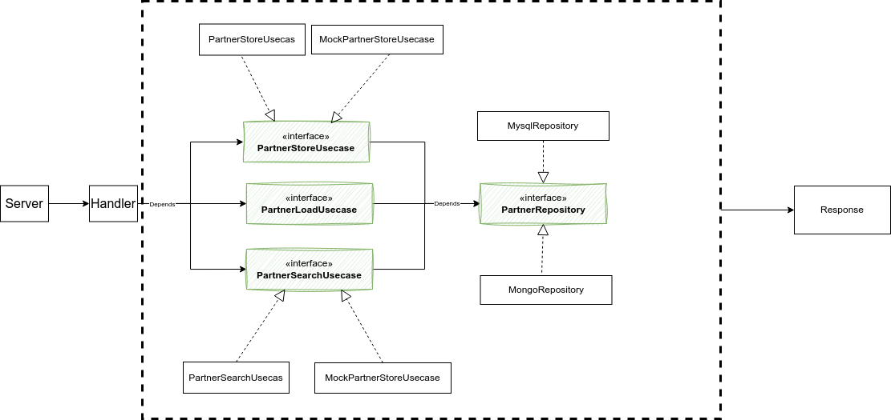

# Digi-express Back-end Challenge

This repository contains an implementation of the Digi express back-end challenge.

## Usage
To use this project, follow these steps:

1. Clone the project repository.
2. Navigate to the cloned project folder.
3. Run the following command in the terminal:
   ```bash
   bash init.sh
   ```
   This will perform a full setup, and the server will start listening on **localhost:8888**.

## Tests
### Running all tests
To run all tests, use the following command:
```bash
docker-compose exec go go test ./...
```

### Running Acceptance tests
To run acceptance tests specifically for the OpenWeather module, use the following command:
```bash
docker-compose exec go go test ./openweather -v
```

## API Documentation
Access the API documentation by visiting the following URL in your web browser:
```
localhost:8888/swagger/index.html
```

## Structure
The project follows Uncle Bob's clean architecture principles and consists of three layers:

1. Models Layer (not mentioned in the diagram)
2. Repository Layer
3. Usecase Layer



All layers are designed to be interchangeable. For example, you can easily replace the `mysqlRepository` with `MongoRepository`, which implements the Partner Repository. Additionally, in tests, you can use a mock usecase for better testability.

Note: The Delivery layer has not been abstracted for the sake of simplicity.
